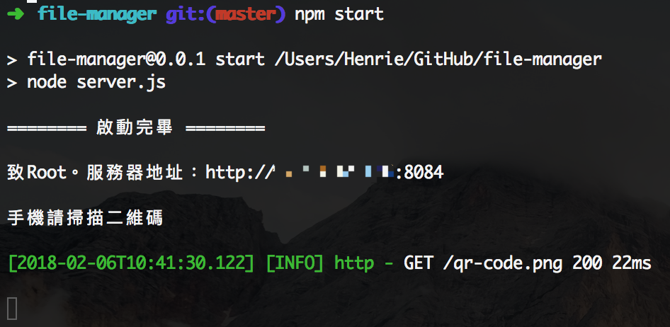
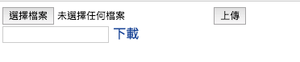

# file-manager ver 0.0.2

基於node.js的，不用數據線實現不同設備間文件傳輸

**大前提：設備在同一個Wi-Fi下**

## 安裝

還是那句你要裝node.js，網上大把教程，我不囉嗦了，默認你已經裝好

然後到github下載代碼

[file-manager](https://github.com/HenriettaSu/file-manager)

在終端機中cd到代碼目錄

```
$ npm i
```

## 配置

一般是不需要的，真的需要的話大概也就兩種情況：

1. 端口被佔用；
2. 發送太久鏈接被斷開（請求超時）；

```js
// config.js
const config = {
    port: 8084, // 端口號
    timeOut: '1200s', // 超時時間
    uploadName: 'myfile',
    uploadUrl: '/attachement/upload',
    downloadFileUrl: '/attachement/downloadFile'
};
```

## 運行

```
$ npm start
```



打碼的地方就是服務器地址，也就是電腦ip，貼心的我還為你們生成了二維碼，運行的時候自動生成在瀏覽器彈出

用瀏覽器打開地址之後會看到一個超級吃藕的介面：



## 使用

### 導出文件

點擊選擇檔案，然後點上傳，然後在項目的upload文件夾中就可以找到那個文件。可以批量上傳

### 導入文件

因為所有請求都必須是客戶端發起，所以要發文件給手機的話也需要手機主要請求

在下載前面的輸入框中輸入文件名（帶後綴），如：01.jpg，然後點下載

## 聯繫與討論

QQ：3088680950

如果發現八阿哥了或者有功能上的建議，推薦通過 `issue` 發起討論。

## License

[MIT license](https://opensource.org/licenses/MIT). 有好的想法歡迎提供。

不接受任何關於介面改進的提議（